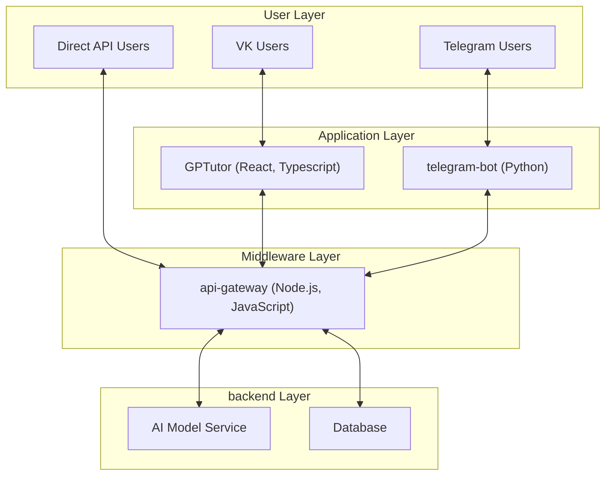

# Deep.Assistant Organization

Welcome to the Deep.Assistant organization! We are dedicated to building AI-powered applications that enhance user experiences across various platforms. Our current projects include:

- **[api-gateway](https://github.com/deep-assistant/api-gateway)**: A central API gateway managing backend services for our applications.
- **[telegram-bot](https://github.com/deep-assistant/telegram-bot)**: A Telegram bot providing AI-powered assistance.
- **[GPTutor](https://github.com/deep-assistant/GPTutor)**: A VK mini-app for AI-driven tutoring.

## Architecture Overview

The following diagram illustrates how our applications interact with each other and the backend services. Additionally, users can directly access the API gateway for OpenAI-compatible services and more. Click on the components to visit their respective GitHub repositories.



## Applications

### api-gateway
- **Description**: Serves as the central API gateway, managing requests from GPTutor, telegram-bot, and direct users to various API providers for GPT, LLM, Image, Music, and other services. It is OpenAI-compatible and accessible via `https://api.deep-foundation.tech/v1`.
- **Technology**: Implemented in Node.js with Express.js for routing.
- **Setup**: Detailed setup instructions can be found in the [api-gateway README](https://github.com/deep-assistant/api-gateway/blob/main/README.md).
- **Quick Start Usage Guide**:
  To get started with the `api-gateway`, obtain an API key from the Telegram bot at [https://t.me/DeepGPTBot](https://t.me/DeepGPTBot) by using the `/api` command. Below is a simple example in JavaScript to interact with the API:

  ```js
  import OpenAI from 'openai';

  const openai = new OpenAI({
    // Replace with your key from /api command from our telegram bot
    apiKey: "YOUR_API_KEY", 
    baseURL: "https://api.deep-foundation.tech/v1/"
  });

  async function main() {
    const chatCompletion = await openai.chat.completions.create({
      messages: [{ role: 'user', content: 'Say this is a test' }],
      model: 'gpt-4o-mini',
    });
    // Should output: "this is a test"
    console.log(chatCompletion.choices[0].message.content);
  }

  main();
  ```

  For more advanced usage (e.g., streaming responses, Whisper transcription) and a full list of available models, refer to the [detailed API documentation](https://github.com/deep-assistant/telegram-bot/blob/main/docs.md).

### telegram-bot
- **Description**: A Telegram bot, branded as **Deep.GPT**, that offers AI-driven assistance, processing user inputs and providing intelligent responses. [Start chatting here](https://t.me/DeepGPTBot).
- **Technology**: Developed in Python, utilizing the python-Telegram-Bot library for Telegram API interactions.
- **Setup**: Detailed setup instructions can be found in the [telegram-bot README](https://github.com/deep-assistant/telegram-bot/blob/main/README.md).

### GPTutor
- **Description**: A VK mini-app, branded as **GPTutor**, that provides AI-powered tutoring services. It leverages the VK platform to reach a wide audience, particularly focusing on Russian-speaking users. [Access it through our VK community](http://vk.com/gptutor).
- **Technology**: Built with React and Typescript, using the [vk-mini-apps-API](https://github.com/VKCOM/vk-mini-apps-api) for seamless integration with VK.
- **Setup**: Detailed setup instructions can be found in the [GPTutor README](https://github.com/deep-assistant/GPTutor/blob/main/README.md).

## Contributing
We welcome contributions to any of our projects! Please read our [contributing guidelines](https://github.com/deep-assistant/.github/blob/main/CONTRIBUTING.md) for more information on how to get involved.

## License
All projects under the Deep Assistant organization are licensed under the [Unlicense](https://unlicense.org/), allowing for maximum freedom in using and modifying the code.

---

Thank you for visiting our organization! For more information, please explore the individual repositories or contact us via GitHub issues.
