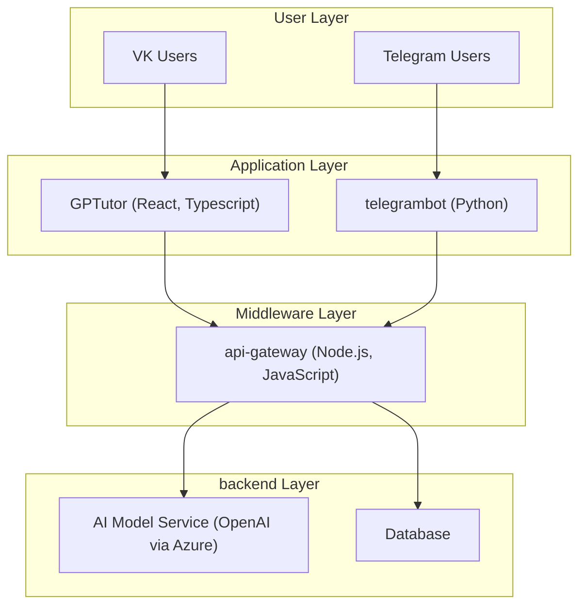

# Deep Assistant Organization

Welcome to the Deep Assistant organization! We are dedicated to building AI-powered applications that enhance user experiences across various platforms. Our current projects include:

- **[GPTutor](https://github.com/deep-assistant/GPTutor)**: A VK mini-app for AI-driven tutoring.
- **[telegrambot](https://github.com/deep-assistant/telegrambot)**: A Telegram bot providing AI-powered assistance.
- **[api-gateway](https://github.com/deep-assistant/api-gateway)**: A central API gateway managing backend services for our applications.

## Architecture Overview

The following diagram illustrates how our applications interact with each other and the backend services. Click on the components to visit their respective GitHub repositories or service pages.

## Applications

### GPTutor
- **Description**: A VK mini-app that provides AI-powered tutoring services. It leverages the VK platform to reach a wide audience, particularly focusing on Russian-speaking users.
- **Technology**: Built with React and Typescript, using the [vk-mini-apps-API](https://github.com/VKCOM/vk-mini-apps-api) for seamless integration with VK.
- **Setup**:
  1. Clone the repository: `git clone https://github.com/deep-assistant/GPTutor.git`
  2. Install dependencies: `npm install`
  3. Run the application: `npm start`

### telegrambot
- **Description**: A Telegram bot that offers AI-driven assistance, processing user inputs and providing intelligent responses.
- **Technology**: Developed in Python, utilizing the python-Telegram-Bot library for Telegram API interactions.
- **Setup**:
  1. Clone the repository: `git clone https://github.com/deep-assistant/telegrambot.git`
  2. Install dependencies: `pip install -r requirements.txt`
  3. Set up your Telegram bot token in the configuration file.
  4. Run the bot: `python bot.py`

### api-gateway
- **Description**: Serves as the central API gateway, managing requests from GPTutor and telegrambot to backend services like AI models and databases.
- **Technology**: Implemented in Node.js with Express.js for routing.
- **Setup**:
  1. Clone the repository: `git clone https://github.com/deep-assistant/api-gateway.git`
  2. Install dependencies: `npm install`
  3. Configure environment variables for Azure OpenAI and database connections.
  4. Run the server: `npm start`

## Contributing
We welcome contributions to any of our projects! Please read our [contributing guidelines](https://github.com/deep-assistant/.github/blob/main/CONTRIBUTING.md) for more information on how to get involved.

## License
All projects under the Deep Assistant organization are licensed under the [Unlicense](https://unlicense.org/), allowing for maximum freedom in using and modifying the code.

---

Thank you for visiting our organization! For more information, please explore the individual repositories or contact us via GitHub issues.
